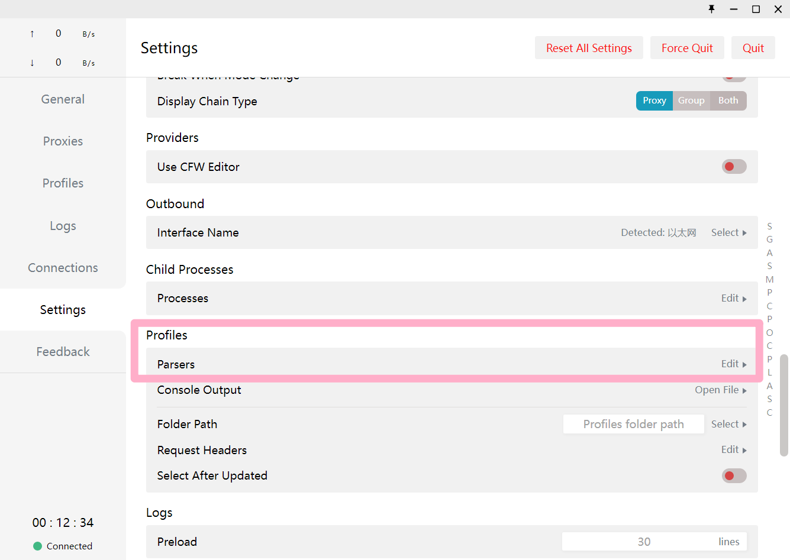
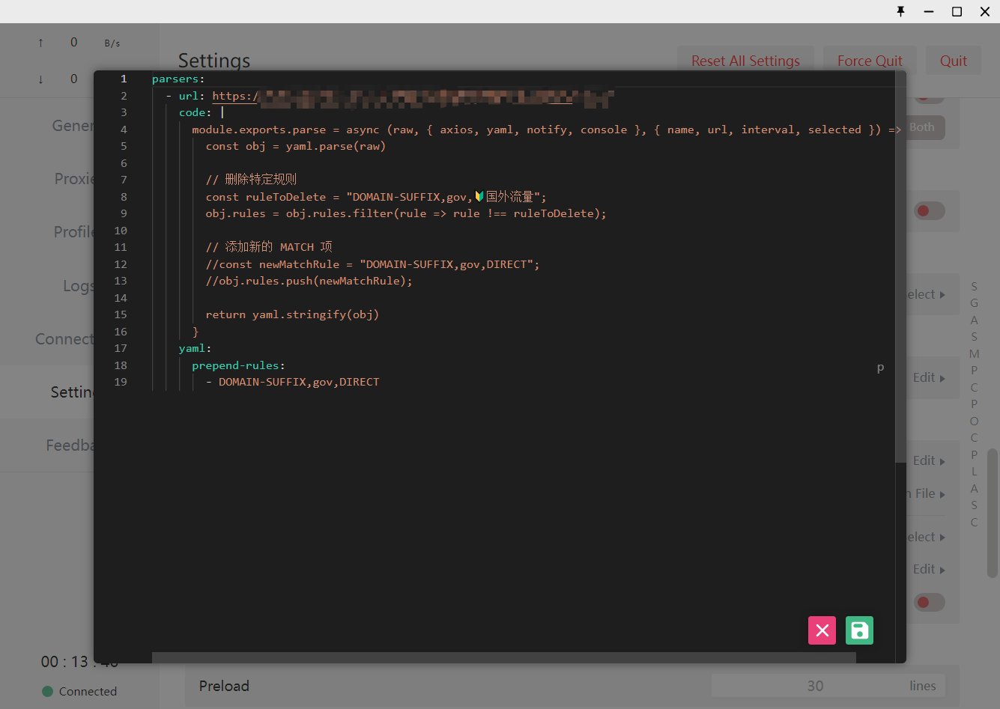

# Clash高级使用parsers自定义代理规则防止自动更新订阅覆盖

>自从Clash官方删库之后，clash详细手册和文档越来越少，官网的手册也随着删库被删除了。这几天整理了一下现存的互联网资料，写了这篇clash进阶教程解决“自动更新订阅会覆盖自己设置的rules问题”


## 问题描述

昨天我花了一下午的时间，费劲心思好不容易整理好了自定义的代理策略和规则，结果今天开机之后发现，某些配置好的网站又访问不了了。经过检查发现是因为clash自动更新订阅的同时，还会同时更新随订阅连接附带的代理规则文件，这个文件直接把我昨天自己配好的规则覆盖了！


## 最终解决记录

经过查找资料，发现网上主要有**两种**不会被自动更新订阅覆盖的方法，分别是

### 一、通过mixin功能混入

这个功能实际上对规则（rules）的混入不友好，作者也是在很新的几个版本才支持对代理规则的混入。故这里不做介绍。

不推荐使用mixin作为自定义代理规则使用！


### 二、通过parser在每次更新订阅时预处理配置文件

打开clash软件，在设置找到`Parsers` 选项：



打开`Edit` 按钮：按照下图编辑（代码见下文）




这段代码分为两部分，第一部分的code通过JavaScript语法解析字符串，通过filter方法，将`ruletoDelete`字符串相等的一个条目去除，然后保留其余部分条目。

第二部分`yaml`代码添加了一条前置预加rules条目。


```json
parsers:
  - url: https://xxxxxxxxxxxxxxxxxxxx
    code: |
      module.exports.parse = async (raw, { axios, yaml, notify, console }, { name, url, interval, selected }) => {
        const obj = yaml.parse(raw)

        // 删除特定规则
        const ruleToDelete = "DOMAIN-SUFFIX,gov,🔰国外流量";
        obj.rules = obj.rules.filter(rule => rule !== ruleToDelete);

        // 添加新的 MATCH 项
        //const newMatchRule = "DOMAIN-SUFFIX,gov,DIRECT";
        //obj.rules.push(newMatchRule);
        //注：这里实际上是无效的，因为在这里添加的条目会被放到rules文件的最末尾，可能被前面的match词条干扰！！！
		//正确的新加条目，应该如下yaml段所示，使用prepend-rules语法添加！
        return yaml.stringify(obj)
      }
    yaml:
      prepend-rules:
        - DOMAIN-SUFFIX,gov,DIRECT


```


# 2024-10-12更新

最新自用parser规则：

```json
parsers:
  - url: https://xxxxxxxxxxxxxxxxxxx
    code: |
      module.exports.parse = async (raw, { axios, yaml, notify, console }, { name, url, interval, selected }) => {
        const obj = yaml.parse(raw)

        // 删除特定规则
        const ruleToDelete1 = "DOMAIN-SUFFIX,gov,🔰国外流量";
        obj.rules = obj.rules.filter(rule => rule !== ruleToDelete1);
        const ruleToDelete2 = "DOMAIN-SUFFIX,microsoft.com,DIRECT";
        obj.rules = obj.rules.filter(rule => rule !== ruleToDelete2);
        // 添加新的 MATCH 项
        //const newMatchRule = "DOMAIN-SUFFIX,gov,DIRECT";
        //obj.rules.push(newMatchRule);
        
        return yaml.stringify(obj)
      }
    yaml:
      prepend-rules:
        - DOMAIN-SUFFIX,gov,DIRECT
        - DOMAIN-SUFFIX,csdn.net,DIRECT
        - DOMAIN-SUFFIX,microsoft.com,🔰国外流量
```


## 特别注意：

- yaml语法的**缩进是两个空格**，不是TAB！！否则会报错
- 配置完成之后，需要**重启clash客户端**才可生效！！！


## 参考资料

[1] https://chenjuefei.com:444/117.html

